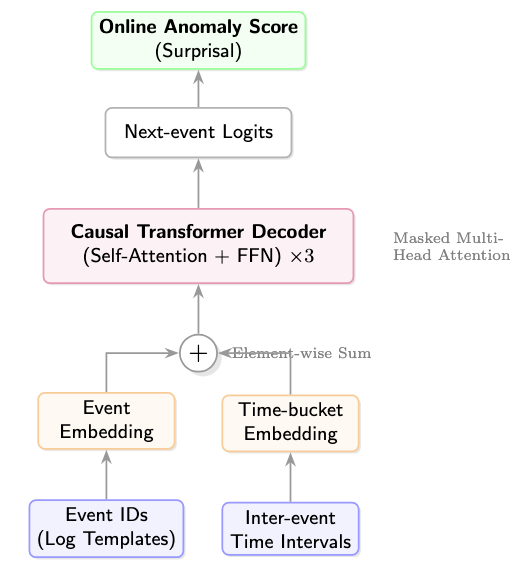

# Time-Aware Causal Transformer for Online Log Anomaly Detection

This repository contains the code and experiments for a lightweight Transformer model designed to detect anomalies in system log sequences. The core idea is simple: learn normal execution patterns from event logs using next-event prediction, and use surprisal during inference to identify abnormal behavior.

The project uses the HDFS dataset as the evaluation benchmark, but the method itself is not tied to a particular system.

---

## Project Overview

System logs naturally form event sequences. When failures occur, these sequences often deviate from normal execution patterns. Instead of relying on rule-based checks or labeled anomaly data, this project trains a causal Transformer to model normal sequences in a self-supervised way.

During inference, the model produces a next-event probability at each step. Higher surprisal indicates that the observed event does not match the model’s learned expectations, allowing us to score anomalies online.

---

## Method

### Data
- Event templates are converted into integer IDs.
- Inter-event time intervals are quantized into buckets to retain basic timing information.
- A maximum sequence length of 32 covers over 99% of HDFS traces.

### Model
- 3-layer causal Transformer decoder  
- 128-dimensional embeddings for events, time buckets, and positions  
- Masked self-attention ensures only past events are used during prediction  

### Training
- Self-supervised next-event prediction  
- Trained only on normal (success) traces  
- converges quickly due to the structured nature of system logs  

### Scoring
For each event:
- Compute surprisal: `-log p(event | past)`
- Use prefix mean/max surprisal as the anomaly signal  
- A threshold is chosen from the distribution of normal sequences  

---

## Results

On HDFS:
- Failure recall: **92.2%**
- False positive rate: **0%** on sampled normal sequences
- Average early detection: **56.9%** of the sequence remaining
- Next-event accuracy during training: **~92–93%**

Surprisal distributions for normal and failure sequences show clear separation, allowing simple threshold-based detection.

---

## Repository Contents

- Jupyter notebook with:
  - Data preparation
  - Model definition
  - Training loop
  - Surprisal scoring functions
  - Threshold selection
  - Evaluation and plots

The notebook is self-contained and documents all steps of the workflow.

---

## Model Structure

A diagram of the model (event embedding + time embedding + causal Transformer) is included in the repository for reference.

---

## Notes

This project is not meant to produce a large or fully optimized detection system. The goal is to show that even a compact autoregressive model can serve as a practical tool for real-time anomaly scoring, provided clean template-based logs are available.

